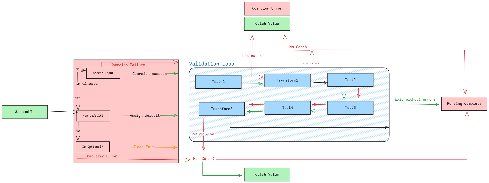

# Parsing

## What is parsing?

To validate and parse your data into a destination pointer you can use the `schema.Parse()` function. The function signature looks like this:

```go
schema.Parse(data, &dest, options...)
```

This works with any Zog Schema:

```go
// string
var dest string
z.String().Min(3).Parse("test", &dest)
// structs
var dest User
z.Struct(z.Schema{"name": z.String().Min(3)}).Parse(map[string]any{"name": "test"}, &dest)
```

Under the hood Zog follows the [Parsing Execution Structure](#parsing-execution-structure) and does a bunch of things under the hood to make sure your data is parsed correctly. Such as checking for zero values, coercing types, etc...

## Coercion

Zog will attempt to coerce the data into the correct type. For example if you have a `z.Int()` schema and you pass in a `"1"` it will be coerced into an `int` type. This behaviour, like almost everything else in Zog, can be customized. Zog provides two main ways to customize coercion:

- [Global Coercion](/configuration#coercion) - Change the default coercion behaviour for all schemas. More details on this in the [configuration page](/configuration#coercion).
- [Per schema coercers](#per-schema-coercers) - Define custom coercion functions for your schemas.

#### Per schema coercers

You can define custom coercion functions for your schemas by using the `z.WithCoercer()` schema option.

```go
z.String(z.WithCoercer(func(data any) (any, error) {
   return "test", nil // now the result will be "test" no matter the input
})).Parse("abc", &dest) // dest will be "test"
```

## Parsing Context

Zog uses a `ParseCtx` to pass around information related to a specific `schema.Parse()` call. Currently use of the parse context is quite limited but it will be expanded upon in the future. It can be used for the following:

#### Pass custom data to functions

Here is an example with a pretransform

```go
nameSchema := z.String().Min(3).PreTransform(func(data any, ctx z.ParseCtx) (any, error) {
  char := ctx.Get("split_by")
  return strings.Split(data.(string), char), nil
})
nameSchema.Parse("Michael Jackson", &dest, z.WithCtxValue("split_by", " "))
```

#### Change the error formatter for this execution

This might be useful for localization, or for changing the error messages for one specific execution.

```go
nameSchema := z.String().Min(3)
nameSchema.Parse(data, &dest, z.WithErrFormatter(MyCustomErrorMessageFormatter))
```

## Parsing Execution Structure



1. Pretransforms
   - On error all parsing and validation stops and error is returned.
   - Can be caught by catch
2. Default Check -> Assigns default value if the value is nil value
3. Optional Check -> Stops validation if the value is nil value
4. Casting -> Attempts to cast the value to the correct type
   - On error all parsing and validation stops and error is returned
   - Can be caught by catch
5. Required check ->
   - On error: aborts if the value is its nil value and returns required error.
   - Can be caught by catch
6. Tests -> Run all tests on the value (including required)
   - On error: validation errors are added to the errors. All validation functions are run even if one of them fails.
   - Can be caught by catch
7. PostTransforms -> Run all postTransforms on the value.
   - On error you return: aborts and adds your error to the list of errors
   - Only run on valid values. Won't run if an error was created before the postTransforms
