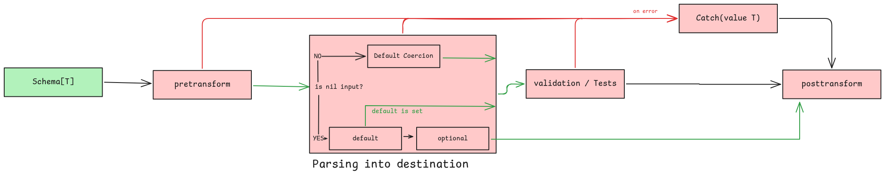

# Parsing

## What is schema.Parse()?

To validate and parse your data into a destination pointer you can use the `schema.Parse()` function. The function signature looks like this:

```go
schema.Parse(data, &dest, options...)
```

This works with any Zog Schema:

```go
// string
var dest string
z.String().Min(3).Parse("test", &dest)
// structs
var dest User
z.Struct(z.Schema{"name": z.String().Min(3)}).Parse(map[string]any{"name": "test"}, &dest)
```

Under the hood Zog follows the [Parsing Execution Structure](#parsing-execution-structure) and does a bunch of things under the hood to make sure your data is parsed correctly. Such as checking for zero values, coercing types, etc...

## Parsing Struct Tags

By default zog will use the schema field name as the key for the parsed value. For example:

```go
type User struct {
	Name string `zog:"name"`
}

z.Struct(z.Schema{"name": z.String()}).Parse(map[string]any{"name": "test"}, &User{}) // note zog will fetch the value as map[name]

type User struct {
	Name string `zog:"name"`
}

z.Struct(z.Schema{"Name": z.String()}).Parse(map[string]any{"name": "test"}, &User{}) // note zog will fetch the value as map[Name]
```

However, this is not always practical. For example, you may have data coming in in kebab case and you want to parse it into camel case. For this Zog supports a few struct tags:

- `json` tag which works for JSON input data
- `form` tag which works for form input data
- `query` tag which works for query string input data
- `env` tag which works for environment variables see [zenv](/packages/zenv) for more info
- `zog` a catch all tag which works for any input data

> The priority of keys is as follows:
> `json` || `form` || `query` || `env` -> `zog` -> schema field name

You can mix and match without issue:

```go
type User struct {
	Name     string `zog:"first-name"`
	LastName string `query:"last_name" json:"last-name"`
}

z.Struct(z.Schema{"name": z.String(), "lastName": z.String()}).Parse(map[string]any{"first-name": "test", "lastName": "Doe"}, &User{})
```

## Coercion

Zog will attempt to coerce the data into the correct type. For example if you have a `z.Int()` schema and you pass in a `"1"` it will be coerced into an `int` type. This behaviour, like almost everything else in Zog, can be customized. Zog provides two main ways to customize coercion:

- [Global Coercion](/configuration#coercion) - Change the default coercion behaviour for all schemas. More details on this in the [configuration page](/configuration#coercion).
- [Per schema coercers](#per-schema-coercers) - Define custom coercion functions for your schemas.

#### Per schema coercers

You can define custom coercion functions for your schemas by using the `z.WithCoercer()` schema option.

```go
z.String(z.WithCoercer(func(data any) (any, error) {
	return "test", nil // now the result will be "test" no matter the input
})).Parse("abc", &dest) // dest will be "test"
```

## Parsing Execution Structure

Parsing execution structure is quite simple. It just does roughly this:

1. Check for nil value
   - If nil take into account if schema has default value or is required
2. Coerce value to the correct type otherwise
3. Run validation loop
   - If a test fails, an issue is added
   - If you return an error from a tesnform, the execution stops and that error is returned.
   - If catch is active any error triggers it and stops the execution.


